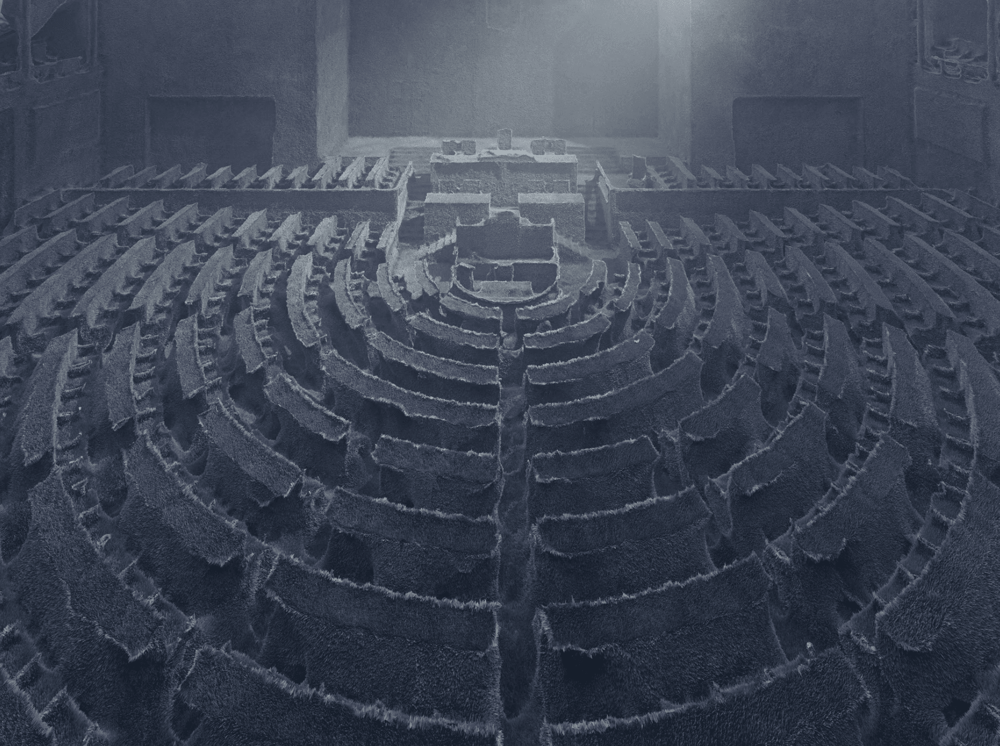
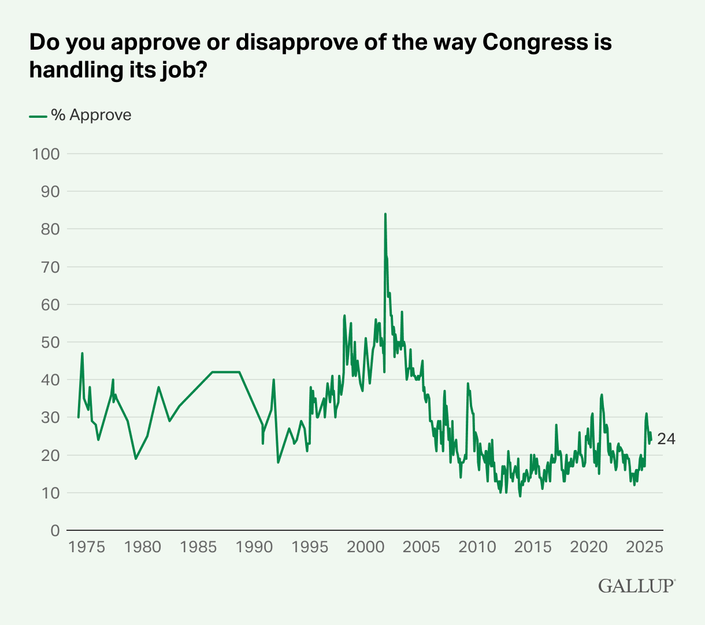
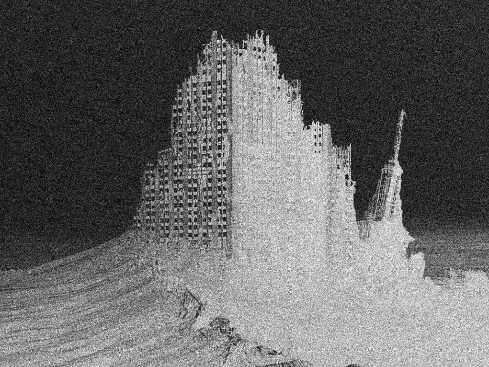

# The Fall of Democracy (and What Comes After)

**Josiah Warren · October 15, 2025**

<!-- body -->

*This article is the second in a series of three pieces. If you haven't already, read [What Happened to the Spirit of Freedom?](https://blog.logos.co/article/spirit-of-freedom) first.*

Democracy isn't dying; it's long dead. What we're smelling now is the stench of its corpse, dressed up in rituals and patriotic branding. The institutions that were once founded on principles of self-governance – elections, checks and balances, freedom of speech – still exist in name, but they're now functionally hollow.

We're not witnessing democracy's betrayal. We're living through its decomposition.

And yet the spirit that birthed the democratic republic, the belief that people can govern themselves in freedom and dignity, lives still, though the hand of authoritarianism extends around the world to snuff it out.

If you've felt something is wrong but haven't been able to put words to the problem or a possible solution, you're not alone. That spirit lives in you. It lives in growing disillusionment, in quiet refusal to accept that this is the best we can do. It echoes in a question rising everywhere: *What happened to liberty?*

To understand how we got here, we have to look honestly at what democracy has become, and what must come next.

The good news is that the Founders saw this coming. In his 1796 farewell address, George Washington warned of "the baneful effects of the spirit of party." James Madison, in "Federalist No. 10", warned that factions would lead to "schemes of oppression" whenever impulse and opportunity coincided and that neither morals nor religion could be trusted to control them. Thomas Jefferson worried that revolution would become necessary from time to time, reasoning that governments, like individuals, grow corrupt without the accountability of renewal. He famously wrote, "The tree of liberty must be refreshed from time to time with the blood of patriots and tyrants."

Jefferson wrote about violent revolution, but that's not what this article series is about. In fact, it's about the opposite. One of the great things about the world's development since Jefferson's time has been active innovation in peaceful mediation. But the Jefferson quotation does show the warnings the Founding Fathers made (with nearly unanimous agreement). They weren't theoretical warnings but a very real awareness of the limitations of the institutions they were creating. In this sense, they became almost predictive. These warnings weren't the reason the democratic institutions they were creating needed to be adaptable; they were warnings about the specific circumstances that would harm their ability to adapt. And we are living in those circumstances today.

## Democracy or theatre?

Today's elections are billion-dollar productions with predictable outcomes. In the most recent US election, 95% of incumbents were reelected, even while public approval of Congress remains below 25%. As Andrew Yang explains in his TED Talk, our system rewards extremism and punishes consensus. Meanwhile, Jim Babka's *The Conflict Machine* shows how politics-as-conflict drives campaigns, media, and even family rifts. While division is profitable for tyrants, it certainly is not for the people living under their tyranny.

Surveys suggest that more than three-quarters of the US population does not approve of the way Congress operates.

Constitutional reform, which could be a significant step in the right direction, demands a two-thirds supermajority in Congress or among state legislatures – all of which are controlled by entrenched party interests. But even if such reform were possible, we might not like its manifestation.

Supreme Court decisions have upheld partisan gerrymandering and declared unlimited political spending a form of protected speech. In that sense, the courts weren't wrong; restricting these tactics risks restricting liberty. However, the fact that Sophie's choices exist at all reveals the fatal flaw: this system cannot evolve without sacrificing the very freedoms it was meant to protect. Reforming it isn't just improbable, it's not structurally possible. Furthermore, it would only entrench the contradictions that already suffocate it.

## When systems can't adapt, they collapse

Democracy once helped diverse people coordinate across space and ideology. But today's systems are too slow, siloed, and captured to evolve.

Even recent presidents have warned of the danger:

- George W. Bush stated, "The health of the democratic spirit itself is at issue [...] When we lose sight of our ideals, it is not democracy that has failed; it is the failure of those charged with preserving and protecting democracy."
- Barack Obama admitted that downplaying disinformation as a threat was a grave mistake.
- Joe Biden, in his farewell speech, warned of oligarchy overtaking what was once a free nation.
- Donald J. Trump, whose followers stormed the US Capitol, has remarked several times on the dangers of "fake news".

Consider the evidence of partisan battles remanding issues to the Conflict Machine:

- The US exited the Paris Agreement in 2020 (and again in 2025), unravelling rare global climate consensus.
- The COVID-19 pandemic response became a partisan culture war, eroding trust in science and institutions.
- From JFK to 6 January, investigations are increasingly filtered through ideology, not fact. The Durham Report, for example, produced no prosecutions but was embraced and condemned along predictable partisan lines – evidence of how truth has become subordinate to political identity.
- Brookings identifies both disinformation and executive overreach as key contributors to US democratic decline.

But misinformation is a symptom, not the disease. In a world where opinions can be bought, democracy faces an impossible choice: suppress speech and violate freedom, or allow it and let the wealthy buy reality.

The same is true with executive power: if the executive breaks the system, an oligarchy forms around the presidency. If it doesn't, gridlock ensures the oligarchy forms around Congress. Either way, democracy dies.

These aren't technically bugs in today's system; they're features – features of a system that can no longer self-correct and for which collapse is imminent. And that collapse comes with consequences.

As legitimacy fades, people disengage. Some radicalise. Others retreat. And the vacuum invites authoritarians and opportunists who thrive in low-trust environments.

We trade agency for convenience. Security for surveillance. Governance for algorithms that stoke outrage to keep us scrolling.

This isn't abstract. It's why families fracture. It's why medications and housing are unaffordable. And why roads crumble and relationships dissolve. We see it. We feel it. And we scroll past it because we feel powerless to stop it.

But the system didn't break because we stopped caring. It broke because it stopped caring about us. Indeed, it stopped caring about us, started resenting us, and then abused us.

And as with any abusive relationship, the only way out is to leave. Difficult? Yes. But necessary.

## Democracy is not voting

Democracy is not voting. Voting is a tool, not a principle. The real value is consent: the ongoing, voluntary consent of the governed. A society of free people choosing the circumstances in which they live rather than having those circumstances chosen for them. We see this in the terminology they chose. "President": the citizen who presides; "representative": the citizen who represents; "candidate": from the same roots as the word "candid", which came to convey sincerity, i.e. a person not just nominated for office, but sincerely striving to represent their constituents. These terms intentionally contrasted terms like "kings", "lords", "nobility", "monarchs", and "oligarchs" (who were the tyrants of their times).

The Founders chose voting as a means of people directly participating in the laws that applied to their lives because it was the best they had at the time. It was the closest they had to coordination at scale, to reward voluntary collaboration, and (they hoped) to punish the tyrannical exercise of coercion. They even feared "majoritarian rule" (that a majority would impose a tyranny on the minority). Today, we have far more sophisticated and effective tools: global communication, automated enforcement, and real-time deliberation. That's the topic of the next article in this series, but if we look not at the solutions the Founders chose for their time, but at the problems they were trying to solve, we can easily see the tools they chose are no longer the best ones for the job and are actually counter-productive to the society they envisioned.

The US Constitution is the oldest written constitution still in use today. But it's cracking.

Clinging to it is like designing a modern city for horse-drawn carriages and lighting it with gas lanterns.

We don't need to romanticise outdated tools to honour the principles behind them.

Lady Liberty's colour is neither red nor blue. It's the colour of light. Her truth needs no partisan filter.

She stands not for dominance, but for dignity. Not for parties, but for people.

## The spirit lives on... in new forms

This isn't a eulogy for democracy, though maybe for the hollow shells of institutions that once sought to serve its ideals. More, though, it's a call to revitalise the American Spirit and, as American pioneers did before, build a New World that will serve us all for generations to come.

Just as the Founders broke from monarchies that failed their ideals, we must evolve beyond the institutions that fail ours.

We aren't abandoning democracy, we're giving it an upgrade.

The American Spirit lives on in immigrants, outcasts, and ordinary people who believe government must serve freedom, not control. America was never about borders. It was about the belief that anyone, from anywhere, could build a life of dignity.

And if the state won't protect that belief, we build something that will.

This isn't just an American problem. In Hungary, Britain, Brazil, Canada, South Korea, and elsewhere, we see similar collapse: disinformation, captured media, sham elections, and unchecked power. These are much grander than national crises; they're symptoms of global decay.

- **Hungary**: Viktor Orbán's regime has transformed the country into an "electoral autocracy", using state subsidies, media capture, and disinformation to suppress dissent and reshape elections.
- **Britain**: Brexit campaigns became emblematic of "post-truth" politics, where targeted disinformation – exemplified by Cambridge Analytica's tactics – undermined informed public debate.
- **Brazil**: Misinformation played a central role in the rise of Jair Bolsonaro. Disinformation, amplified via social media, undermined trust in democratic norms and polarised discourse.
- **Canada**: Ahead of recent federal elections, over a quarter of Canadians were exposed to complex, highly polarising fake content on social media, raising alarms over the integrity of democratic information spaces.
- **South Korea**: Democratic erosion has accelerated under President Yoon Suk-yeol. Attempts to declare martial law, prosecute opponents, and control media echo classic patterns of democratic backsliding.

## What comes next?: Consent, not control

You've been told this is a battle between left and right. That if your party wins – if the swamp is drained, or if the fascists or communists are voted out – everything will be fixed.

But ask yourself: Has it ever been?

Each party tells two truths about the other – corruption, manipulation – and one comforting lie about themselves – that they are the solution.

Because while we fight, they fundraise. While we sacrifice, they entrench. While we burn out, they burn through donor dollars on messaging wars they have no intention of winning. Like a domestic counterpart to the Military-Industrial Complex, the fight is more profitable than the peace. That's the Political-Industrial Complex. That's the Conflict Machine.

This isn't a partisan failure. It's a design failure – a system that mutated to manage power instead of distributing it. One that sells the illusion of consent, but no longer honours it.

The American Spirit was never about choosing between tyrants. It was about refusing to be ruled by them.

To quote the Declaration of Independence:

> But when a long train of abuses and usurpations, pursuing invariably the same Object evinces a design to reduce them under absolute Despotism, it is their right, it is their duty, to throw off such Government, and to provide new Guards for their future security.

The American Spirit isn't gone. It's evolving.

That's the promise of Logos: a movement to build voluntary infrastructure for sovereign, self-governing digital societies:

- Where consent, not coercion, is the constitution.
- Where laws are auditable code, not political theatre.
- Where rules are applied fairly and automatically, with no regard for donations.
- Where communities form organically, built by diverse people to improve their own lives.
- Where freedom is practised, daily, not granted by favour or permission.

This is not the end of democracy. It's a new beginning.

Not a revolution in the streets, but a reinvention of the systems.

Not rebellion for rebellion's sake, but taking responsibility and building something better.

You don't need to wait for permission.

You don't need to wait for collapse.

You can start right now.
