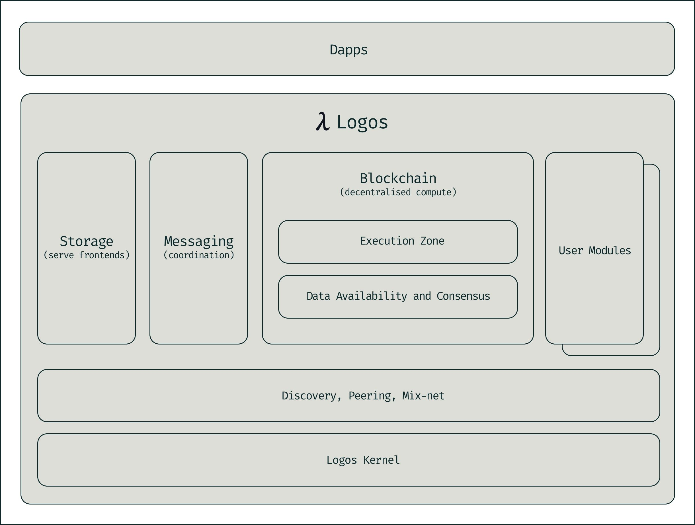

# Building Freedom Without Gatekeepers

**Josiah Warren · January 30, 2026**

<!-- body -->

*Read [What Happened to the Spirit of Freedom?](https://blog.logos.co/article/spirit-of-freedom) and [The Fall of Democracy (and What Comes After)](https://blog.logos.co/article/fall-democracy) in this series.*

The previous essays in this series traced a familiar arc: democratic institutions hollowed out by scale, incentives, and capture; legitimacy stretched thinner with every emergency; trust replaced by surveillance, compliance, and force… aka, the Iron Law of Oligarchy in action.

That diagnosis matters, but diagnosis alone is not the work.

This concluding piece is about construction.

History suggests that when institutions cease to serve the people they claim to represent, they are rarely repaired from within. They are outgrown. New forms of coordination emerge alongside the old, initially small and imperfect, but better suited to the conditions of their time. Over time, people gravitate towards what works. Not unlike the very rise of America described in the first and second articles in this series.

We are living through one of those moments now.

## Exit as care, not rebellion

Leaving a system that no longer works is often framed as abandonment or disloyalty. In reality, it is usually an act of responsibility. When a structure becomes brittle, coercive, or extractive, doubling down on dependence only deepens the harm.

The alternative is not confrontation or collapse. It is parallel construction: building new options that coexist peacefully, operate lawfully, and earn participation rather than demand it. Exit, in this sense, is not rebellion. It is care: for oneself, for one's family, and ultimately for society itself. It's not about leaving America behind because it's broken; it's about building America anew because it's worth fixing.

Healthy systems do not require captivity to survive… they compete.

## What Logos is (and what it is not)

Logos is a decentralised technology stack designed to support voluntary, plural, and censorship-resistant societies. Upon the Logos stack, tools for coordination, governance, and the creation of public goods can be deployed without reliance on centralised authority or enforced dependency.

Logos is not a state.

Logos is not a company.

Logos is not a secessionist project or a call to withdraw from civic life.

Logos is best understood as infrastructure: a shared foundation that allows many different communities to form, define their own rules, and coordinate on their own terms while remaining interoperable with one another and compatible with the laws of the places people already live.

## The design philosophy

Rather than prescribing a single ideal society, Logos is built around a small number of structural guarantees:

- **Consent by default:** Participation is opt in. Authority is earned through continued agreement, not imposed by position.
- **Exit and portability:** Individuals can leave communities without losing their identity, relationships, or history.
- **Pluralism and competition:** Many societies can coexist, experiment, and improve, with none permanently dominating.

These are design constraints embedded in how the system works, not moral aspirations enforced by good intentions.

## Choice as the engine of better societies

In a Logos-enabled world, improvement is driven by choice.

If you want strong privacy and mutual aid, you can join a community organised around those values.

If you want minimal services and maximum self-reliance, you can choose that instead.

If you want cooperative insurance, shared infrastructure, or community mediation, those can exist, too.

Public goods are still public, but they are voluntary, transparently funded, and accountable to the people who rely on them. Exit pressure keeps stewards honest. Alignment is rewarded; extraction is punished by irrelevance.

This is not privatisation by another name. It is the restoration of genuine public choice.

## The Logos technology stack

Logos supports this model through three core layers:

- **A blockchain layer:** For shared rules, agreements, and consent-based coordination. Privacy is not an add-on; it is foundational.
- **A messaging layer:** For secure, peer-to-peer communication and used for deliberation, alerts, coordination, and governance without centralised intermediaries.
- **A storage layer:** For durable, verifiable records such as charters, budgets, proposals, and evidence, designed to resist censorship and loss.

Together, these layers allow communities to coordinate at scale without surrendering control to platforms or institutions that cannot be exited.

## What will people use Logos for?

In practice, Logos will support modest, concrete use cases before grand ones:

- Mediation and dispute resolution to reduce reliance on low-trust court systems
- Community treasuries and mutual aid funds with transparent governance
- Credentials, membership, and contribution records that are portable and verifiable

These are services people already need, not abstractions. And they'll be implemented in ways that reduce dependence on brittle intermediaries.

## How it all scales: Gradually and peacefully

Change does not arrive all at once.

The first Logos-enabled societies will be small: neighbourhood initiatives, professional guilds, local mutual aid, or online communities with real-world coordination needs. Over time, these groups interoperate, sharing standards, resolving disputes, and pooling resources where it makes sense.

Eventually, larger umbrella societies can emerge, offering shared services across many smaller communities. This mirrors how supranational institutions formed historically (the first "congresses" in America were largely held in local taverns), but without coercive authority or permanent capture.

Scale is earned, not simply declared.

## Coexistence, not conflict

Logos is not about overthrowing states or evading the law. It is about lawful, peaceful competition through better design.

When people have access to systems that are more trustworthy, more responsive, and more humane, institutions are forced to adapt. That adaptation benefits everyone, including those who never directly participate.

No revolution is required, and no permission is needed.

## An open invitation

Logos is built by contributors, not decrees. It needs technologists and lawyers, writers and designers, mediators and organisers: people willing to test ideas, launch small pilots, and refine what works.

We are long on opportunity and short on hands.

If freedom is to endure in the digital age, it must be built into the systems we rely on, not defended endlessly against their failures. The door is open. Not to escape what exists, but to begin building what comes next.
