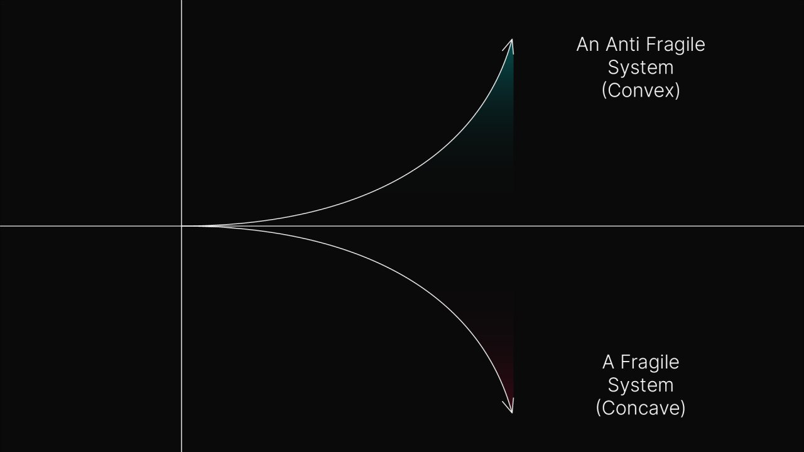
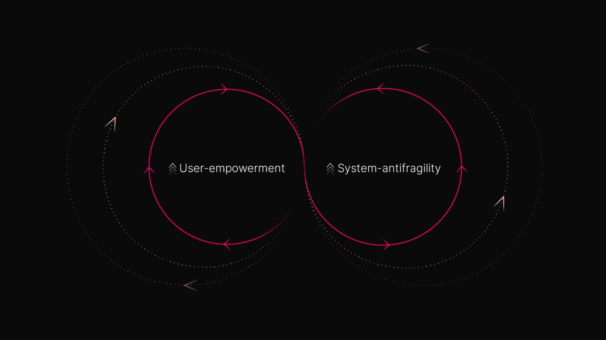
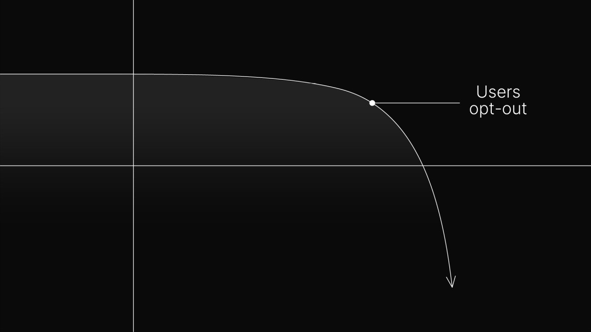
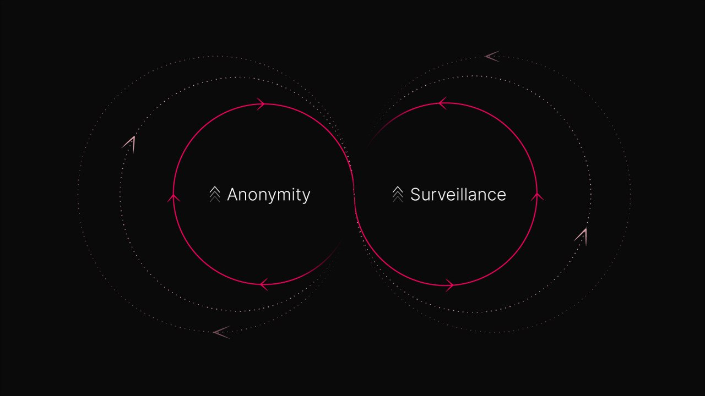
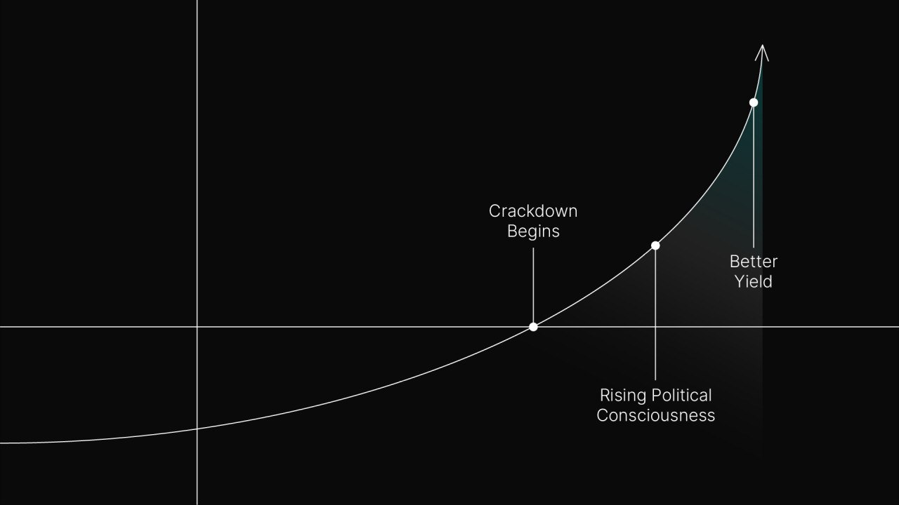
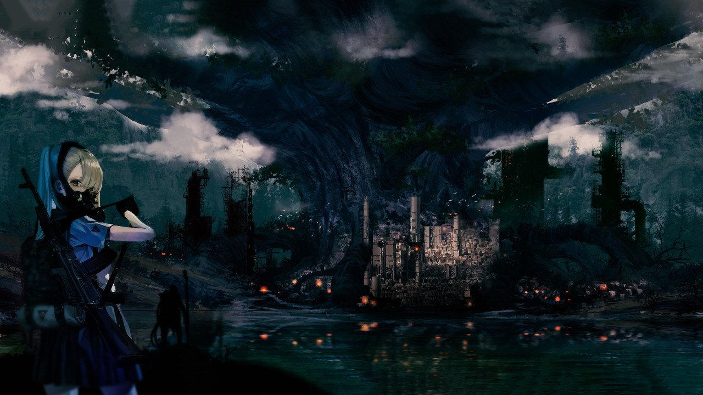

# Lunarpunk and the Dark Side of the Cycle

**By lunar-mining · 22 February 2022**

Science fiction is a speculative exercise. By speculating on possible futures, sci-fi expands the space of possibilities. Crypto is an extreme kind of sci-fi because as well as offering a vision of the future it also provides the tools to make that future possible.

Crypto is currently energized by a sci-fi called solarpunk. Evolved from cyberpunk, solarpunk is a utopian vision of the future characterized by its optimism. For solarpunks, the future is bright. Solarpunk casts away the dystopian shadows of cyberpunk and illuminates a world beyond the chaotic horizon.

In Ethereum, solarpunk hackers are creating [transparent infrastructures](https://www.coindesk.com/tech/2021/09/02/are-daos-socialist/) for funding public goods. The imaginary here is simple: decentralization and transparency will lead to a fairer and more just world. Web 3 is creating a new path for humanity, which old institutions will inevitably follow.

Solarpunk is crypto's conscious mind. It is bright, self-confident, and future-oriented. Yet the counterpart to solarpunk faith is lunarpunk skepticism. Lunarpunks are the solar shadow-self. They are the unconscious of this cycle. While "solarpunks join DAOs" ([Dylan-Ennis](https://x.com/post_polar_)), lunarpunks are preparing for war, and building privacy-enhanced tooling to protect their communities.

Lunarpunk first came into being as a subset of solarpunk. It has always preferred encryption over the plaintext paradigm offered by Ethereum. Overtime, the tensions created by solarpunk tendencies have only multiplied. Lunarpunk is forced to break away from the solarpunk legacy and assert its own.

In the lunarpunk imaginary, a conflict between crypto and existing power structures is essentially preprogrammed. Regulation forces crypto underground. Anonymity proliferates. In the interstellar darkness, freshly radicalized crypto factions create a new kind of democratic society.

This conflict is repressed in solarpunk psychology. The lunar cycle is rejected as a bearish nightmare. Its foundational conflict: nation-state's banning crypto — is called FUD because it produces fear, the kind of fear that compels people to grab their money and run.

As the supercycle segments, solarpunk repression is mounting. The optimism of solarpunk has become synonymous with bull market cycles, while pessimism is associated with the bear. Lunarpunk offers something beyond this simple oscillation. It is a moment of insight between market cycles, a glitch in the hologram where the source code shines through.

## Solarpunk fragility

Fragile is something that breaks when shaken. Antifragile is something that absorbs shocks and becomes stronger.

The fate of antifragility follows a convex curve, while fragility is concave.

The antifragility of crypto has been repeatedly emphasized. Yet crypto today exists on a fragility spectrum. The extent of its resilience will only be demonstrated when under sufficient external pressure. If crypto's defenses hold, convexity is its fate. Otherwise we will see a race to the bottom, concave-style.

Consider the following. Crypto's core innovation is a diptych — it empowers users while diffusing its attack surface (in equal proportion). User empowerment is negatively correlated with fragility; the more empowered a user base, the more antifragile a network becomes.

User-empowerment and system-antifragility are in positive feedback with each other. But this cycle also runs in reverse. In a transparent system, users are exposed. If the external environment turns hostile, this information can be weaponized against them. Faced with persecution, users will opt-out, triggering a descent into fragility.

The solarpunk mindset is essentially optimistic. Transparency in solarpunk systems is the spirit of optimism projected outward. By building transparent systems, the solarpunk says: I have faith that the law won't turn against me. Its insistence on optimism prevents it from preparing for the worst case scenario. This is the core of solarpunk fragility.

## Dark optionality

Taleb's thesis on antifragility hinges on unknowability. According to Taleb, the future is dark: it cannot be predicted with meaningful certainty. He describes optionality as the "weapon of antifragility" due to its ability to leverage this darkness to its advantage. Optionality assumes your prophecies are wrong most of the time. Being wrong is cheap, while being right is disproportionately rewarding.

Lunarpunk integrates optionality because it thrives in the worst-case scenario. If the lunarpunk thesis is wrong, the supercycle continues. If it's right, crypto enters its next phase armed with the appropriate defenses. Being well-defended means going dark: using cryptography to protect the identity and activity of users. This is the cornerstone of lunarpunk convexity.

In the solarpunk future, users flee when faced with persecution. But lunarpunks offer user protection. Participants in dark networks have plausible deniability. Changes in regulation do not affect them. The only reason why a regulatory crackdown would cause users to leave a network is if they do so voluntarily.

Crypto's antifragility is only demonstrated when anonymity is coupled with persecution. Still, to be truly antifragile crypto must do more than survive a regulatory onslaught. It must flourish under attack. Lunarpunks believe that through anonymity, escalating conflict simply empowers crypto; an empowerment which is exponential with the aggressor's decline.

## Convexity: a Prophesy

Anonymity is first compelled into being as an adaptation to mass surveillance. But its existence also further justifies surveillance efforts. This is a positive feedback loop that implies anonymity and surveillance are fated to escalate.

In a paradigm defined by its surveillance, the anonymity of crypto makes it alien. Left running long enough, the loop triggers the next phase in lunarpunk convexity — what I call the regulation trap. In this phase, attackers use the increase in anonymity as a scapegoat to leverage the full extent of their power against crypto.

Yet by cracking down on crypto, hostile powers simply further justify it. Crypto's usefulness is correlated with the extent of the crackdown: it expands disproportionately with each received blow. *Antifragility.*

The regulation trap forces crypto underground. This comes with a number of consequences:

### 1. Rising political consciousness

Anonymity is a catalyst for crypto's political consciousness. Post-regulatory crackdown, the crypto and fiat worlds are more clearly distinguished from each other. Only by establishing this separation can crypto build a new world that reflects its values.

### 2. Center is eliminated

A crypto at war is a hardened crypto. Those factions who are more willing to compromise with hostile powers will blend into the power apparatus or be eliminated. This is a kind of extinction event of ethically compromised projects. In time, it will empower crypto by vindicating its most ideological elements.

### 3. Better yield

Crypto is littered with the corpses of bad incentive design. Nowhere is this more densely concentrated than among legacy privacy coins. They are a master class in poor coin distribution and inflationary policies. The offset of this is that the true value of privacy projects is potentially much higher.

The new wave of privacy programmers are at ease with financial engineering. Thus the final stage in lunarpunk convexity is economic. Lunar settlements are only accessible by those who voluntarily reject the fiat paradigm. Anonymous offworlds offer a kind of revolutionary yield for those ideological enough to traverse the no man's land.

## The Lunar Cycle

The sun is both a symbol of nature and of tyranny. Through its insistence of transparency and identity, solarpunk inherits the dual characteristics of its central symbol. Solarpunk systems are desert landscapes in which users are endangered and exposed.

Lunarpunk is more like a forest. A dense cover of encryption protects tribes and offers sanctuary for the persecuted. Wooded groves provide a crucial line of defense. Lunar landscapes are dark. They are also teeming with life.

Lunar tech is owned and operated by the people themselves in service of their freedom. Lunar settlements are a sanctuary where difference is nurtured and protected. The lunar cycle upholds democratic techniques against authoritarian technology, freedom against surveillance, and diversity against monoculture.

Lunarpunk's believe freedom can only be found outside the logic of domination. This means lunar society must completely decouple itself from the current paradigm. As such the lunarpunk future is born from a conflict that solarpunks seek to avoid.

This solarpunk repression is its weakest point. Solarpunk cannot build the vision it projects if it has already integrated the oppression that it hopes to break away from. By favoring transparency in its systems, solarpunk is tragically engineering its fate. Surveillance — the mechanism of authoritarianism — is bound to the solarpunk destiny.

For solarpunk to succeed it must integrate the lunarpunk unconscious. The only hope for solarpunk is to go dark.

---

*Thanks to [Paul](https://x.com/post_polar), [Amir](https://x.com/lunardragon420) and [Matti](https://x.com/mattigags) for feedback, and to [Armor](https://x.com/zkarmor/) for his diagrams and artwork.*

*This article was originally published on the 22nd February 2022 in [egirl capital](https://web.archive.org/web/20221130084023/https://www.egirlcapital.com/writings/107533289).*
