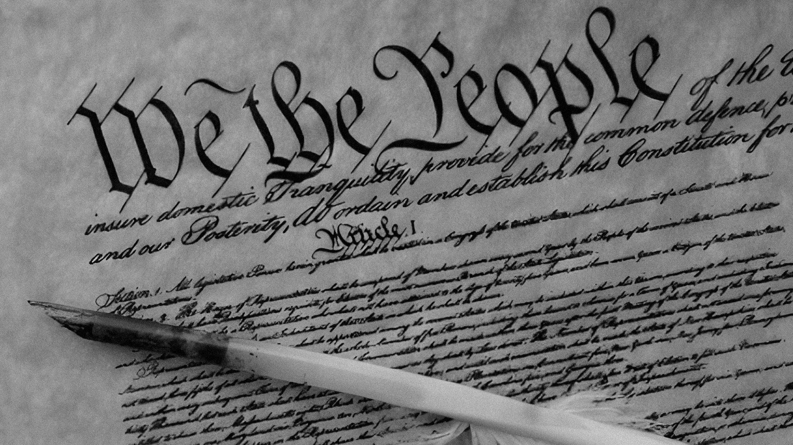
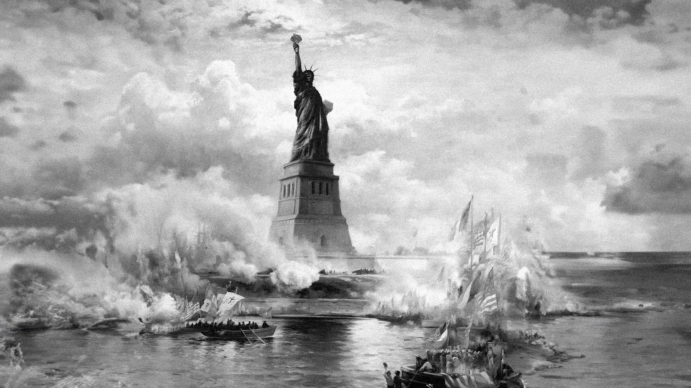

# What Happened to the Spirit of Freedom?

**Josiah Warren · July 4, 2025**

<!-- body -->

The Spirit of Freedom that once stirred revolutions and lit the fires of self-governance now flickers uncertainly across the modern world. In the United States and many democracies abroad, people feel a growing disconnect between the ideals they cherish and the political systems meant to uphold them. There's disillusionment, yes. But more than that, there is a question echoing louder than ever: What happened to the promise of liberty?

This article is not about the death of democracy. It is about its mutation. Because what people are mourning isn't just institutional decay or partisan gridlock – it's the fading of something more essential. Call it the American Spirit. The Flame of Liberty. The deeply felt belief that a society should be governed by its people, not just procedurally but in practice, not by force or fiat, but through mutual respect and voluntary association. Free both in the freedom of equal opportunity and freedom from the tyranny of others.

## The Spirit of '76: Lady Liberty visits a monarchy

The American experiment began as a radical act. The founding generation, deeply inspired by Enlightenment thinkers and often organised through networks like the Sons of Liberty and the Freemasons, sought not merely independence from Britain, but a fundamental reimagining of society. Their aim was not just a new nation, but a new kind of nation – a society based on the sovereignty of the people.

Before the Constitution, there was a Declaration. Before recognition, there was refusal. The Founding Fathers did not wait for permission; they exited. Across the colonies, networks of thinkers and neighbours discussed what a just society could look like – without kings, without inherited power, and without imposed rule. They were not trying to restore order – they were inventing new legitimacy.

What they were building was unprecedented. With pamphlets as their social media and printing presses as their blockchain, they used the best tools of their time to forge a new model of governance. They wrote a constitution, yes, but that came later. What mattered most was the spirit they carried: a belief that government should be by consent, law should be mutual agreement, and rights were not granted by rulers but inherent to people. To quote the Constitution:

> We the People of the United States, in Order to form a more perfect Union, establish Justice, insure domestic Tranquility, provide for the common defense, promote the general Welfare, and secure the Blessings of Liberty to ourselves and our Posterity, do ordain and establish this Constitution for the United States of America.

It was always an imperfect experiment. It may have ushered in an age of global prosperity and empowerment, but it was an experiment nonetheless. And that matters – because experiments evolve. And they don't require permission. We can start new ones.

## Liberation tools

The printing press wasn't just a communication device – it was infrastructure. Pamphlets like Thomas Paine's *Common Sense* reached hundreds of thousands (a wide circulation for a time when the colonies only had a scant few million people), shifting public opinion toward revolution. Unlike in Europe, where entrenched powers controlled the presses, the colonies could speak amongst themselves freely and be heard. This freedom of the press was a central value of early American society.

Today, even when we *can* speak without government censorship or private moderation, it still takes major marketing dollars to ensure we're heard. The effect is similar to that experienced in Europe during the early days of the printing press: power around the world is consolidating at the expense of individual freedom.

In the colonies, legal systems were still forming – imperfect, diverse, yet participatory. John Adams, one of the earliest defenders of procedural fairness, famously defended British soldiers after the Boston Massacre because he believed in due process even for one's enemies. Especially for one's enemies. Because the Founding Fathers themselves were enemies of the state.

They believed in authority by design, not by decree. Community courts, accessible laws, and legible standards formed the bedrock of trust. These weren't just gestures – they were shields against tyranny. The executive didn't stand above the law; it was bound by it. And the state was accountable to the press, not the other way around. These ideas feel distant today. Liberty and justice feel distant today. The American Spirit feels distant today.

## Not just a statue

It's easy to mythologise the Founding Fathers, to cast them as saints or demons. But they were neither. They were humans responding to immense pressure and unprecedented possibility. Many held deeply contradictory beliefs – some fought for liberty while denying it to others. Slavery was not a flaw to be debated; it was a violent injustice. The fact that such injustice persisted alongside the rhetoric of universal rights should not be interpreted as democratic ambiguity, but as the clearest proof that freedom must always be secured for and by those who feel its absence. The debates weren't the success – what mattered was the belief that systems could change, and that they must.

The American Spirit felt distant to them, too – an aspiration that called on them to strive for self-governance. To imagine a society in which individuals could define and pursue the best version of themselves, free from arbitrary power, united by mutual respect rather than imposed rule.

And in that sense, the American Spirit isn't so American at all. It's not bound to flag, territory, or tradition, but to the unyielding idea that liberty and justice are for all. The Statue of Liberty, of Lady Liberty herself, was a gift from the French and its spirit is well captured in "The New Colossus" by Emma Lazarus:

> Not like the brazen giant of Greek fame,
>
> With conquering limbs astride from land to land;
>
> Here at our sea-washed, sunset gates shall stand
>
> A mighty woman with a torch, whose flame
>
> Is the imprisoned lightning, and her name
>
> Mother of Exiles. From her beacon-hand
>
> Glows world-wide welcome; her mild eyes command
>
> The air-bridged harbor that twin cities frame.
>
> "Keep, ancient lands, your storied pomp!" cries she
>
> With silent lips. "Give me your tired, your poor,
>
> Your huddled masses yearning to breathe free,
>
> The wretched refuse of your teeming shore.
>
> Send these, the homeless, tempest-tost to me,
>
> I lift my lamp beside the golden door!"

Today's challenges are different. But the call is the same. We live in an age of algorithmic control, surveillance, and systemic inertia. But the Spirit still calls now more than ever in our lifetimes. More than ever, Lady Liberty roams, seeking a new door by which to hold up her light, a beacon of hope to exiles yearning for a brighter future.

That fire is freedom.

We are the colonists of today, hearing the call of tomorrow's frontier – not in worship of the past, but in extension of its best hopes. If you hear the call, come blaze a trail into the future of governance with us.

Start now.

You don't need permission.

You don't need to wait.
